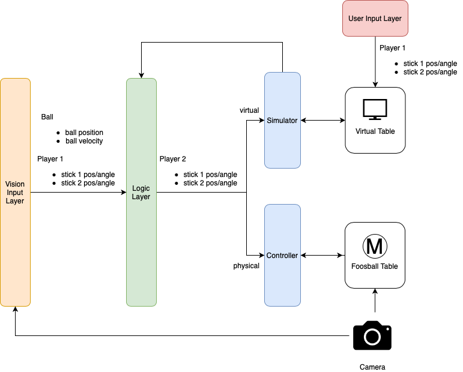

# autofoosball

## Description
An automatic foosball playing robot. Our goal is to be able to consistently beat the average joe on a small sized 2x2 stick foosball table.

## Architecture

### Simulator
TODO

### Controller
TODO

### Logic
TODO

### Vision
TODO
